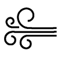

# Notos 

Public repository of the Notos robot project of the [Kolleg St. Thomas][kst] robotics group, 2016/2017

[kst]:http://www.kolleg-st-thomas.de

----------

# Prerequisites
- Using the OpenSCAD models here requires having the [XasCode Library][XasCode] next to this (the Notos) repository, as the Tagging.scad function is used.
	Later on the AVR libraries of that repository will also be used, so it is recommended to clone it completely!
- To properly work with the AVR Code, it is recommended to install the [AVR-Plugin for eclipse][avrplug] (for C and C++ eclipse versions)
	The current workspace is in EclipseWS. Eclipse should auto-detect the projects, if not, use the "import C++ project" function and import the project folders inside EclipseWS

[avrplug]:http://avr-eclipse.sourceforge.net/wiki/index.php/The_AVR_Eclipse_Plugin
[XasCode]:https://www.github.com/XasWorks/XasCode
